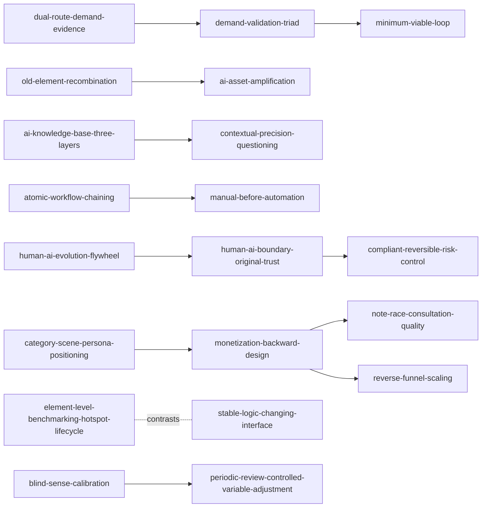

# 叁斤 131 篇帖子 — Atomic Skill Index

> 本目录由 cangjie-skill 从 131 篇帖子蒸馏，形成 28 个可执行原子 skills。

## 关于这组帖子

- **作者**：叁斤
- **时间范围**：2023—2026（原帖时间跨度）
- **一句话主旨**：从真实需求出发，用最小闭环验证机会，再把有效经验沉淀为可复用流程、知识资产和反馈系统。
- **整书理解**：[BOOK_OVERVIEW.md](./BOOK_OVERVIEW.md)
- **精华长文**：[DIGEST.md](./DIGEST.md)
- **术语词典**：[GLOSSARY.md](./GLOSSARY.md)

## Skill 列表

### 机会、需求与验证

- [`old-element-recombination`](./old-element-recombination/SKILL.md) — 把已有资产与新条件重组为可测试机会
- [`ai-asset-amplification`](./ai-asset-amplification/SKILL.md) — 判断 AI 是否放大已有资产
- [`explicit-potential-demand`](./explicit-potential-demand/SKILL.md) — 区分显性需求与潜在需求
- [`dual-route-demand-evidence`](./dual-route-demand-evidence/SKILL.md) — 用搜索与主动表达双路取证
- [`demand-validation-triad`](./demand-validation-triad/SKILL.md) — 用问题、行为、成交三类证据验证需求
- [`minimum-viable-loop`](./minimum-viable-loop/SKILL.md) — 先跑通最小闭环再扩张
- [`long-term-project-filter-knowledge-transfer`](./long-term-project-filter-knowledge-transfer/SKILL.md) — 筛选长期项目并迁移能力

### 内容、定位与对标

- [`category-scene-persona-positioning`](./category-scene-persona-positioning/SKILL.md) — 用品类×场景×人设定位
- [`element-level-benchmarking-hotspot-lifecycle`](./element-level-benchmarking-hotspot-lifecycle/SKILL.md) — 按元素对标并判断热点生命周期
- [`stable-logic-changing-interface`](./stable-logic-changing-interface/SKILL.md) — 分离稳定逻辑与变化界面
- [`blind-sense-calibration`](./blind-sense-calibration/SKILL.md) — 用隐藏数据盲测校准网感
- [`capture-then-filter-content`](./capture-then-filter-content/SKILL.md) — 先记录真实素材再筛选
- [`quality-content-before-equipment-vanity`](./quality-content-before-equipment-vanity/SKILL.md) — 优先内容价值而非设备与虚荣指标

### AI、流程与知识资产

- [`ai-knowledge-base-three-layers`](./ai-knowledge-base-three-layers/SKILL.md) — 搭建信息—故事—判断三层知识库
- [`contextual-precision-questioning`](./contextual-precision-questioning/SKILL.md) — 补齐上下文并让 AI 反问
- [`atomic-workflow-chaining`](./atomic-workflow-chaining/SKILL.md) — 把复杂任务拆成原子流程
- [`manual-before-automation`](./manual-before-automation/SKILL.md) — 手动跑通后再自动化
- [`human-ai-evolution-flywheel`](./human-ai-evolution-flywheel/SKILL.md) — 记录人改 AI 并回写规则
- [`human-ai-boundary-original-trust`](./human-ai-boundary-original-trust/SKILL.md) — 划定人机边界与原创信任
- [`product-tiered-continuous-delivery`](./product-tiered-continuous-delivery/SKILL.md) — 按层级交付并持续更新产品

### 执行、复盘与增长

- [`act-problem-feedback-loop`](./act-problem-feedback-loop/SKILL.md) — 先行动、遇题、解决并反馈
- [`periodic-review-controlled-variable-adjustment`](./periodic-review-controlled-variable-adjustment/SKILL.md) — 周期复盘并控制变量
- [`monetization-backward-design`](./monetization-backward-design/SKILL.md) — 从变现目标倒推账号与产品
- [`note-race-consultation-quality`](./note-race-consultation-quality/SKILL.md) — 用投放赛跑与咨询质量筛选内容
- [`reverse-funnel-scaling`](./reverse-funnel-scaling/SKILL.md) — 先验证窄场景再反漏斗扩张
- [`interest-before-compliant-acquisition`](./interest-before-compliant-acquisition/SKILL.md) — 以用户兴趣为合规引流前提
- [`antifragile-business-assets`](./antifragile-business-assets/SKILL.md) — 建立可迁移的反脆弱业务资产
- [`compliant-reversible-risk-control`](./compliant-reversible-risk-control/SKILL.md) — 用授权、可撤销和交叉验证控制风险

## 引用图

## 推荐学习顺序

1. 先读 `explicit-potential-demand`、`dual-route-demand-evidence` 和 `old-element-recombination`，建立机会判断。
2. 接着读 `demand-validation-triad`、`minimum-viable-loop`，把假设落到真实反馈。
3. 再读 `category-scene-persona-positioning`、`monetization-backward-design`、`note-race-consultation-quality`，连接定位、变现与质量。
4. 最后读 AI/流程和风险组：`ai-knowledge-base-three-layers` → `contextual-precision-questioning` → `atomic-workflow-chaining` → `manual-before-automation` → `human-ai-boundary-original-trust` → `compliant-reversible-risk-control`。

## 审计轨迹

- 候选池：[candidates/](./candidates/)
- 淘汰记录：[rejected/](./rejected/)
- 三重验证：[verified.md](./verified.md)
